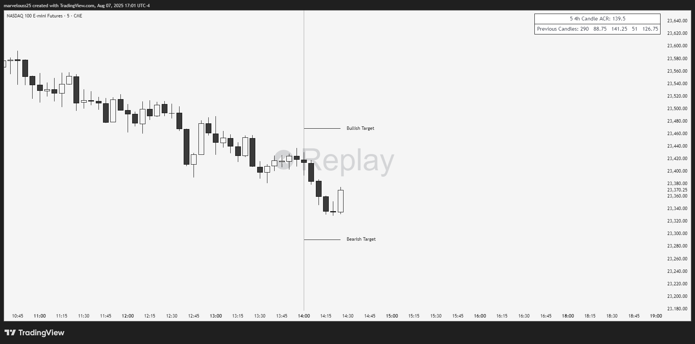

# ACR (Average Candle Range) With Targets

## Overview
This Pine Script indicator calculates the Average Candle Range (ACR) based on an inputted number of previous candles and a user-selected timeframe. It uses each candle’s high and low to compute an average range and then draws bullish and bearish target lines for the current candle based on that average. This helps traders estimate the potential range of the selected candle period automatically.

## Why I Built It  
I built this indicator to make average range targeting more flexible and accessible for both **scalping** and **swing trading**, not just intraday use. The ability to choose **any timeframe** for the average range calculation sets it apart from most similar tools on TradingView, which are usually locked to daily ranges. My goal was to create something more **versatile and unique** for traders who want to adapt this concept to different styles and timeframes.

## Features
- Calculates ACR over a customizable number of previous candles.
- Selectable timeframe (e.g., 1H, 4H, 1D, etc.).
- Draws vertical lines to mark the beginning of each new candle in the selected timeframe.
- Extends target lines a user-defined number of bars past the current price.
- Displays a table showing the average range and the past 5 candle ranges.
- Draws bullish and bearish target lines based on the current candle’s high or low plus/minus the average range.
- Customizable line styles (solid, dotted, dashed), colors, widths, and labels.
- Adjustable table position, frame, and border width.
- Options to toggle display of targets and table elements.

## Inputs
- **Timeframe** for ACR calculation (e.g., "1H", "4H", "1D").
- **Number of candles** for ACR calculation.
- Toggle display of bullish and bearish targets.
- Extend targets a custom number of bars.
- Show average range and previous 5 candles in the table.
- Customize colors for lines and table.
- Set table position on the chart.
- Choose line style and width.
- Customize target line labels.
- Toggle session marker lines.

## How to Use
You can use this indicator in any of the following ways:

1. Search for **"ACR - Average Candle Range With Targets"** in the **Community Scripts** section on [TradingView](https://tradingview.com).
2. Or go directly to the indicator via this link:  
   🔗 [ACR - Average Candle Range With Targets](https://www.tradingview.com/script/DGTUR9I6-ACR-Average-Candle-Range-With-Targets/)

Once added to your chart, open the **settings menu** to customize the indicator according to your trading preferences.

## Recommended Use
This indicator is well-suited for virtually any trading style—including **intraday**, **swing trading**, and **scalping**. It is valuable for traders who want to understand and estimate the price range within a chosen timeframe, helping with trade planning across different market conditions and time horizons.

## Limitations
- If price exceeds the calculated range early in the candle, the target lines may no longer be relevant.
- Use this indicator as a **guide**, not a guaranteed signal.
- Results depend on the timeframe and number of candles selected.

## License
This project is licensed under the [MIT License](LICENSE).

## View on TradingView
You can find the public version of this indicator on TradingView:  
🔗 [ACR - Average Candle Range With Targets](https://www.tradingview.com/script/DGTUR9I6-ACR-Average-Candle-Range-With-Targets/)
