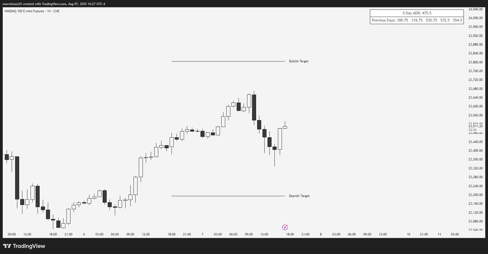

# ADR With Targets

## Overview
This Pine Script indicator calculates the Average Daily Range (ADR) based on an inputted number of previous days. It uses each day’s high and low to compute an average range and then draws bullish and bearish target lines for the current day based on that average. This helps traders estimate the potential range of the current trading day automatically.

## Why I Built It
I built this tool to assist with my trading by automating the estimation of the day’s expected range, which I used to calculate manually in my head. This indicator removes the guesswork by providing precise average range calculations and visual targets.

## Features
- Calculates ADR over a customizable number of previous days.
- Displays a table showing the average and ranges of the past 5 days.
- Draws bullish and bearish target lines based on the current day’s high or low plus/minus the average range.
- Customizable line styles (solid, dotted, dashed), colors, widths, and labels.
- Adjustable table position, frame, and border width.
- Options to toggle display of targets and table elements.

## Inputs
- **Number of days** for ADR calculation.
- Toggle display of bullish and bearish targets.
- Show average range and previous 5 days in the table.
- Customize colors for lines and table.
- Set table position on the chart.
- Choose line style and width.
- Customize target line labels.

## How to Use
1. Copy the full Pine Script code.
2. Open [TradingView](https://tradingview.com) and go to the chart where you want to use the indicator.
3. Open the Pine Editor tab at the bottom of TradingView.
4. Paste the code into the editor.
5. Click **Add to Chart**.
6. Customize the settings through the indicator’s input menu — everything is designed to be intuitive.

## Recommended Use
This indicator is best suited for **intraday trading** and traders who want to estimate and trade most of the daily price range.

## Limitations
- If the market makes a range larger than the calculated ADR early in the day (either bullish or bearish), the target line may no longer be relevant.
- Use this indicator as a guide, not a guaranteed signal.

## License
This project is licensed under the [MIT License](LICENSE).

---

Feel free to customize this further or let me know if you want me to help you add screenshots, badges, or other sections!
